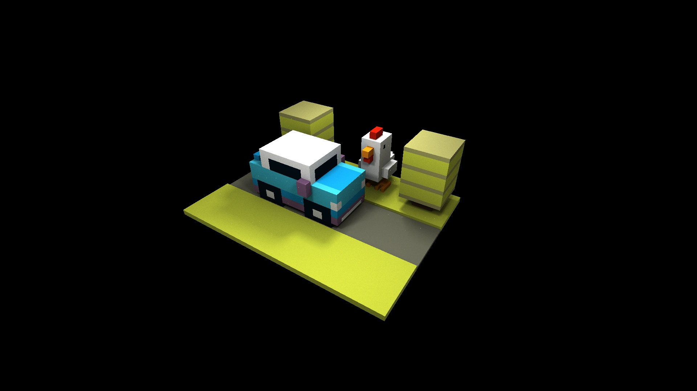

## Ray Engine: A minimalistic header-only path tracer framework

C++ implementation of the monte carlo path tracer with support for:

- [x] PBR Maps (specular, diffuse, shading normals, roughness, metallic)
- [x] BRDF evaluation (currently only Phong Specular and Lambertian, Torrance-Sparrow Microfacet model coming soon)
- [x] HDRI maps (only constant color right now, texture map support comming soon) 
- [x] BVH over surface area heuristic
- [x] Direct Lighting  
- [x] Indirect Lighting from throughput
- [x] Multiple Importance Sampling
- [x] Russian Roulette
- [x] Antialiasing  
- [x] Debug Rasterization  
- [x] Parallelization and load balancing

This project is coded in 48 hours for the final project of USC CSCI420 computer graphics
To use this project, simply clone the repository, and add this subdirectory to your `CMakeLists.txt`. 
The exact details in how to register geometry and lights are provided in the `scene.h` file.

Refernce: Matt Pharr, Wenzel Jakob, and Greg Humphreys : "Physically Based Rendering:From Theory To Implementation 4th Edition" (pbr-book.org).

Other examples:

